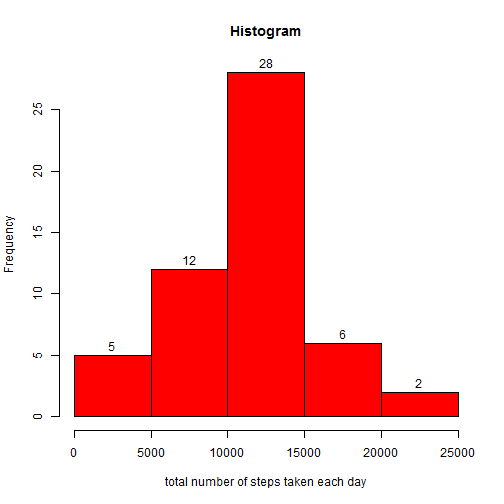
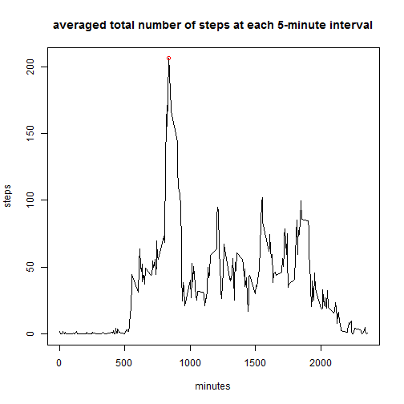
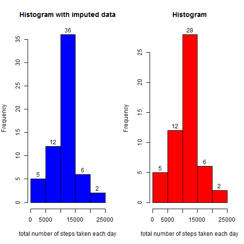
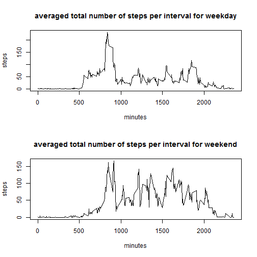

# TITLE: Reproducible Research: Peer Assessment 1

## Loading and preprocessing the data


```r
# loading the data

data <- read.csv("activity.csv",header=TRUE,stringsAsFactors=FALSE)

# Cleaning the data from missing values and saving it into data1

data1 <- data[-which(is.na(data$steps)),]
rownames(data1) <- NULL
```

## What is mean total number of steps taken per day?


```r
# Histogram of total number of steps taken each day

par(mfrow=c(1,1))

steps_day <- tapply(data1$steps,data1$date,sum)
hist(steps_day,col="red",main="Histogram", labels=TRUE,
     xlab="total number of steps taken each day")
```

 

```r
#Mean and median total number of steps taken each day

steps_day_mean <- mean(steps_day)
steps_day_median <- median(steps_day)
```

The mean total number of steps taken each day is 1.0766189 &times; 10<sup>4</sup> and
the median one is 10765.

## What is the average daily activity pattern?


```r
steps_interval <- aggregate(data1$steps,by=list(interv=data1$interval),mean)
max_steps <- max(steps_interval$x)
interval_max_steps <- 
    steps_interval$interv[which(steps_interval$x==max(steps_interval$x))]

plot(steps_interval$interv,steps_interval$x,type="l",
     main="averaged total number of steps at each 5-minute interval",
     xlab="minutes",ylab="steps")
points(interval_max_steps, max_steps, col = "red")
```

 

The 5-minute interval that contains the maximum number of steps is the
835, that has 206.1698113 steps on average and it can 
be seen as red circle point on the above graph.


## Imputing missing values


```r
# number of missing data in the original file
number_NA_steps <- sum(is.na(data$steps))
number_NA_date <- sum(is.na(data$date))
number_NA_interval <- sum(is.na(data$interval))

# Imputing the mean for each 5-minute interval
imputed_data <- data
for (i in which(is.na(data$steps))) {
    imputed_data[i,1] <- steps_interval$x[which(steps_interval$interv==data[i,3])]
}

imp_steps_day <- tapply(imputed_data$steps,imputed_data$date,sum)
par(mfrow=c(1,2),mar=c(5,4,4,2))
hist(imp_steps_day,col="blue",main="Histogram with imputed data",
     xlab="total number of steps taken each day",labels=TRUE)
hist(steps_day,col="red",main="Histogram",
     xlab="total number of steps taken each day",labels=TRUE)
```

 

```r
# Calculating mean and media total number of steps taken
# each day for imputed data

imp_steps_day_mean <- mean(imp_steps_day) #Mean of total number of steps taken each day
imp_steps_day_median <- median(imp_steps_day) #Median of total number of steps taken each day
```

The number of missing values is 2304 for steps, 
0 for date, and 0 for interval. So, the data has missing values only in steps. 

We have imputed the mean of steps for each 5-minute interval. For imputed data, the mean total number of steps taken each day is 1.0766189 &times; 10<sup>4</sup> and the median one is 1.0766189 &times; 10<sup>4</sup>. As we can see, there is no significant difference in mean and median total number of steps taken per day.

Also, the histogram is very similar. The only difference is the central frequency, that is higher for case of imputed data, due to days that contained missing values and were computed now.

## Are there differences in activity patterns between weekdays and weekends?


```r
# Activity patterns between weekdays and weekends 

imputed_data$wday <- weekdays(as.Date(imputed_data$date))
imputed_data$wday <- ifelse(imputed_data$wday=="domingo"|imputed_data$wday=="sábado",
                            "weekend","weekday")

data_weekday <- imputed_data[which(imputed_data$wday=="weekday"),]
rownames(data_weekday) <- NULL
data_weekend <- imputed_data[which(imputed_data$wday=="weekend"),]
rownames(data_weekend) <- NULL

steps_weekday <- aggregate(data_weekday$steps,
                           by=list(interv=data_weekday$interval),mean)
steps_weekend <- aggregate(data_weekend$steps,
                           by=list(interv=data_weekend$interval),mean)

par(mfrow = c(2, 1)) #,mar = c(4, 4, 2, 1))
plot(steps_weekday$interv,steps_weekday$x,type="l",
     main="averaged total number of steps per interval for weekday",
     xlab="minutes",ylab="steps")
plot(steps_weekend$interv,steps_weekend$x,type="l",
     main="averaged total number of steps per interval for weekend",
     xlab="minutes",ylab="steps")
```

 

The activity patterns between weekdays and weekends have a somewhat of a difference. The number of steps on weekend is better distributed in time and on weekdays is more concentrated on a small interval of time.
